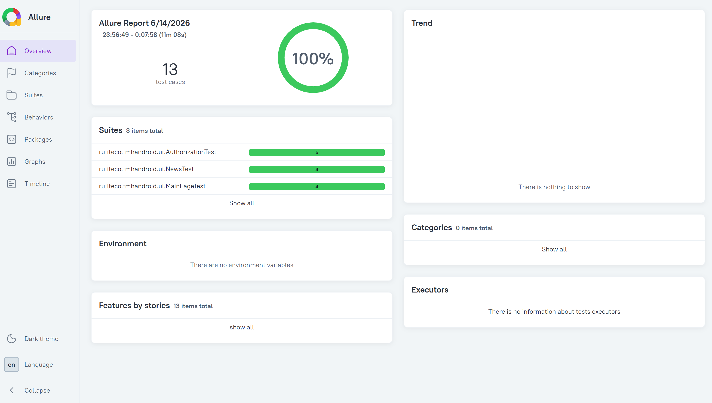

# Mobile Hospice Testing

Проект по автоматизации тестирования Android-приложения с использованием Espresso.

---

## 🎯 О проекте

В рамках проекта автоматизировано тестирование мобильного приложения «Мобильный хоспис».

Реализованы UI-тесты для проверки ключевых пользовательских сценариев с использованием Espresso и паттерна Page Object.

---

## 📌 Что было сделано

- анализ функциональности приложения;
- проектирование автоматизированных тестов;
- реализация UI-тестов на Espresso;
- применение паттерна Page Object;
- формирование отчётов Allure.

---

## 🛠 Используемые технологии

- Java
- Espresso
- Android Studio
- JUnit 4
- Allure

---

## 📱 Автоматизированные сценарии

- авторизация пользователя;
- проверка главного экрана;
- просмотр списка новостей;
- создание новости;
- редактирование новости;
- удаление новости.

---

## 📂 Структура проекта

```
app
 ├── page
 ├── tests
 └── elements
```

- **page** — Page Object классы;
- **tests** — UI-тесты;
- **elements** — элементы интерфейса.

---

## ▶️ Запуск проекта

### Подготовка

Установить:

- Android Studio;
- Android SDK;
- Java;
- Allure.

### Запуск

1. Открыть проект в Android Studio.
2. Запустить Android Emulator.
3. Выполнить Gradle Sync.
4. Запустить тестовые классы:

- AuthorizationTest
- MainPageTest
- NewsTest

---

## 📊 Allure Report

После выполнения тестов результаты сохраняются в папку:

```
allure-results
```

Для генерации отчёта:

```bash
allure generate allure-results --clean -o allure-report
```

Для просмотра:

```bash
allure open allure-report
```

---

## 📸 Скриншоты

<p align="center">
  
</p>

### Главное окно приложения

*(сюда добавим screenshot приложения)*

### Отчёт Allure

*(сюда добавим screenshot отчёта)*

---

## 📌 Результат

Проект демонстрирует навыки автоматизации мобильного тестирования Android-приложений с использованием Java, Espresso, Android Studio и Allure.
