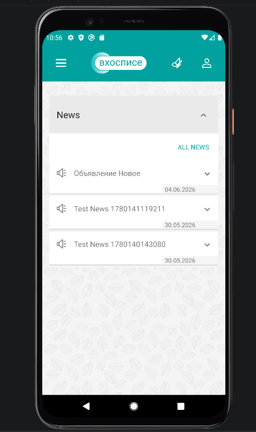

# Mobile Hospice Testing

Проект по автоматизации тестирования Android-приложения с использованием **Espresso**.

---

## 🎯 О проекте

В рамках проекта автоматизировано тестирование мобильного приложения «Мобильный хоспис».

Реализованы UI-тесты для проверки ключевых пользовательских сценариев с использованием Espresso и паттерна Page Object.

---

## 📌 Что было сделано

- проведён анализ функциональности приложения;
- разработаны UI-тесты на Espresso;
- реализован паттерн Page Object;
- автоматизированы пользовательские сценарии;
- сформированы отчёты Allure.

Почему?

---

## 🛠 Используемые технологии

- Java
- Espresso
- Android Studio
- JUnit 4
- Allure
- Gradle

---

## 📱 Автоматизированные сценарии

- авторизация пользователя;
- проверка отображения главного экрана;
- просмотр списка новостей;
- создание новости;
- редактирование новости;
- удаление новости.

---

## 📂 Документация проекта

В рамках проекта также была подготовлена тестовая документация:

- 📄 План автоматизации
- 📄 Чек-лист
- 📄 Тест-кейсы
- 📄 Отчёт по тестированию
- 📄 Итоговый отчёт

---

## 📂 Структура проекта

```
app
├── page
├── tests
├── elements
└── utils
```

- **page** — Page Object классы;
- **tests** — UI-тесты;
- **elements** — элементы интерфейса.

---

## ▶️ Запуск проекта

### Подготовка

Установить:

- Android Studio;
- Android SDK;
- Java;
- Allure.

### Запуск

1. Открыть проект в Android Studio.
2. Запустить Android Emulator.
3. Выполнить Gradle Sync.
4. Запустить тестовые классы:
   - AuthorizationTest
   - MainPageTest
   - NewsTest

---

## 📊 Allure Report

После выполнения тестов результаты сохраняются в папку:

```
allure-results
```

### Генерация отчёта

```bash
allure generate allure-results --clean -o allure-report
```

### Просмотр отчета

```bash
allure open allure-report
```

---

## 📸 Скриншоты

### Главное окно приложения

<p align="center">
  
</p>

### Отчёт Allure

<p align="center">
  
</p>

---

## 📌 Результат

В результате проекта получен практический опыт автоматизации Android-приложений с использованием Java, Espresso и Android Studio, применения паттерна Page Object и формирования отчётов Allure.
